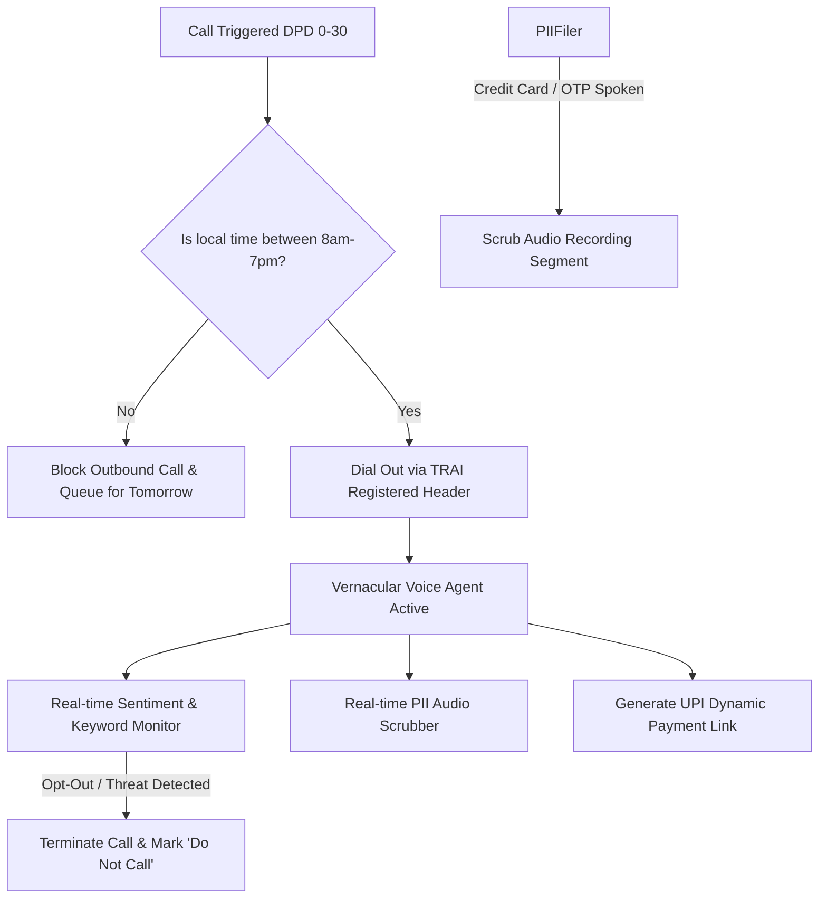
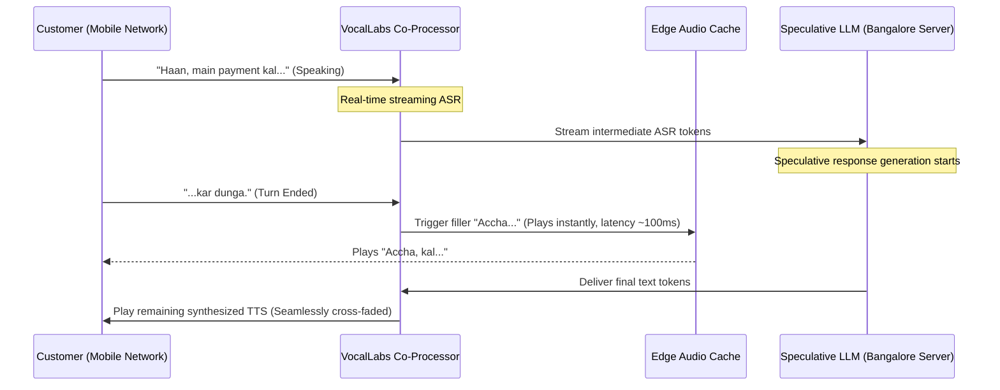
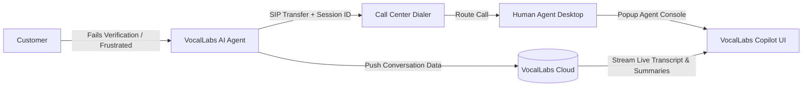
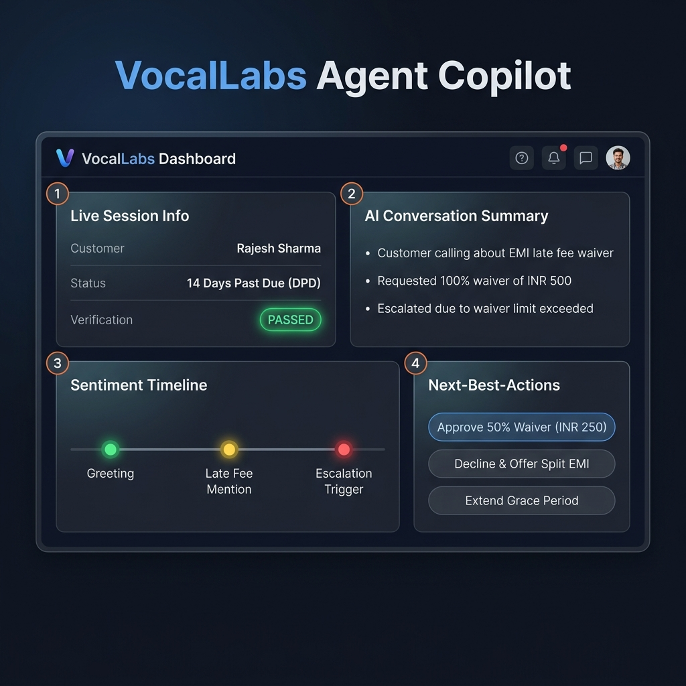

# PRODUCT TEARDOWN: VOCALLABS.AI
**Unlocking High-Volume Vernacular Enterprise Voice Automation**

*Prepared for the VocalLabs.ai Product Intern Assignment*  
*Candidate Report | Focus: High-Execution Product Ownership*

---

## Executive Summary
VocalLabs.ai is positioned at the convergence of conversational AI, generative voice technology, and enterprise workflow automation. While the platform boasts impressive core features (unscripted flows, hybrid agent routing, n8n nodes, and regional accents), it faces intense competition from global middleware players (e.g., Vapi, Retell AI, Bland AI) and local Indian conversational suites. 

To win the Indian enterprise market and create defensible moats, VocalLabs.ai must transition from a **horizontal developer tool** to a **verticalized, low-latency conversational engine** optimized for regional dialects, strict compliance, and legacy enterprise software integration. 

This teardown outlines **5 sharp, actionable feedbacks** across the five core product pillars, structured using **SWOT**, **Porter's Five Forces**, and the **7Ps Marketing Mix** frameworks, accompanied by architectural diagrams, trade-off analyses, a prioritization matrix, and key metrics.

### VocalLabs.ai Strategic SWOT Analysis

| **STRENGTHS (S)** | **WEAKNESSES (W)** |
| :--- | :--- |
| • Full-stack ownership (design → execution → analytics).<br>• India-first tuning for accents & n8n workflows.<br>• Flexible hybrid routing (AI ↔ live agent). | • Horizontal targeting increases sales cycle times.<br>• Sequential middleware architecture creates latency.<br>• Brittle script builder for non-linear turn detours. |
| **OPPORTUNITIES (O)** | **THREATS (T)** |
| • Verticalizing in NBFC collections (DPD 0-30).<br>• Speculative decoding and caching to cut latency.<br>• Direct marketplace distribution (Exotel, Zoho). | • Tightening RBI guidelines on voice compliance.<br>• Commoditization by Vapi/Retell using local APIs.<br>• Call center churn and cold handover customer drop-off. |

---

## Table of Contents
1. [Pillar 1: GTM & ICPs — The Compliance-First NBFC Recovery Pack (Framework: SWOT & Targeting)](#pillar-1-gtm--icps--the-compliance-first-nbfc-recovery-pack)
2. [Pillar 2: Competitor Analysis — Speculative Latency Co-Processor (Framework: Porter's Five Forces)](#pillar-2-competitor-analysis--speculative-decoding--edge-cached-latency-co-processor)
3. [Pillar 3: Features & Services — State-Machine Guided Prompting (Framework: Process Optimization)](#pillar-3-features--services--state-machine-guided-goal-directed-prompting)
4. [Pillar 4: UX — The "Contextual Handover" Copilot Console (Framework: 7Ps Marketing Mix)](#pillar-4-ux--the-contextual-handover-copilot-console)
5. [Pillar 5: Potential Collaborations — Cloud Telephony & CRM PhoneBridges (Framework: Channel Power)](#pillar-5-potential-collaborations--cloud-telephony-marketplaces--crm-phonebridges)
6. [Prioritization & ICE Framework](#prioritization--ice-framework)
7. [Verification Plan & Metrics Dashboard](#verification-plan--metrics-dashboard)

---

## Pillar 1: GTM & ICPs — The Compliance-First NBFC Recovery Pack [Framework: SWOT & Targeting]

### (a) Observed
VocalLabs.ai has a broad, horizontal marketing approach targeting sales outreach, customer support, and appointment scheduling across general industries (e-commerce, logistics, finance).

### (b) Problem
Selling generic AI voice agents in the Indian market results in low retention and high churn. Horizontal voice agents are treated as simple cost-cutting commodities. In India, high-volume voice operations are concentrated in highly regulated sectors—specifically **Fintech and Non-Banking Financial Companies (NBFCs) debt collection (DPD 0-30)**. 
Fintechs and NBFCs face extreme regulatory pressure from the Reserve Bank of India (RBI) regarding:
1. **Calling Hours**: Restricting recovery calls strictly between 8:00 AM and 7:00 PM.
2. **Harassment Boundaries**: Immediate cessation of calls if a customer expresses distress or explicitly asks not to be contacted.
3. **Data Privacy**: Avoiding recording sensitive customer details (like full credit card numbers or UPI PINs spoken over the phone).
A generic call script builder does not prevent an LLM from hallucinating, violating calling hours, or capturing PCI-DSS data, representing a massive compliance risk that keeps risk-averse enterprise buyers from adopting AI voice agents.

### (c) Ship Instead: "Compliance-First Vernacular NBFC Recovery Pack"
Pivot GTM to a specialized, pre-packaged solution specifically certified for early-stage Indian fintech and NBFC debt collections. 



#### Key Capabilities:
* **Telephony Time-Locks**: Hardcode dialer rules at the SIP trunk level that block outbound collection calls outside the RBI-approved 8:00 AM – 7:00 PM window, automatically adjusting for the customer's regional timezone (calculated from lead location or phone prefix).
* **PII Audio Scrubber**: Implement a low-latency, real-time audio masking engine. When ASR detects numeric strings matching card numbers or OTPs, the system automatically mutes those frames in the stored audio recording, maintaining PCI-DSS and RBI data audit compliance.
* **Consent & Escalation Guardrails**: Train a small, deterministic classification model that overrides the LLM when specific phrases (e.g., *"Suicide"*, *"Court"*, *"Harassment"*, or *"Don't call me again"*) are detected, instantly terminating the call or routing it to a senior human collections manager.
* **Vernacular Accent Tuning**: Pre-train acoustic profiles on Hinglish, Tamil-English, and Telugu-English containing local financial colloquialisms (e.g., *"Kist"*, *"Due date"*, *"Bouncer charge"*).

#### Trade-off Analysis:
* **Drawback**: Reduces the addressable market size by focusing heavily on collections rather than all sales/support use cases.
* **Benefit**: Creates a high-margin, high-volume, and deeply sticky product. Lenders will pay a premium (e.g., pricing per successful recovery rather than simple per-minute API rates) for a solution that carries zero regulatory risk and provides a 15-20% uplift over SMS collections.

---

## Pillar 2: Competitor Analysis — Speculative Latency Co-Processor [Framework: Porter's Five Forces (Threat of Substitutes)]

### (a) Observed
VocalLabs.ai highlights a "bring-your-own-model" architecture, functioning as a middleware orchestration layer that routes audio between telephony providers, ASR (Speech-to-Text), LLMs, and TTS (Text-to-Speech) engines.

### (b) Problem
Global developer platforms (like Vapi and Retell AI) have optimized their internal voice pipelines to achieve low latency. If VocalLabs.ai functions as a sequential middleware orchestrator (Telephony Input $\rightarrow$ External ASR API $\rightarrow$ LLM API $\rightarrow$ External TTS API $\rightarrow$ Telephony Output), the round-trip latency on typical Indian VoLTE/4G/3G networks is **1.8 to 2.5 seconds**. 
This latency causes:
1. **Conversational Collisions**: The customer starts speaking again because of the awkward silence, only for the AI agent to interrupt them when the response finally arrives.
2. **Break in Fluency**: Humans expect a response within **400 - 600ms**. Anything above 1 second feels artificial and results in high drop-off rates (users hang up thinking the call is broken).
3. **No Tech Moat**: Any developer can build a sequential orchestration layer on Vapi or Bland AI in a few minutes; the middleware wrapper itself is not a defensible moat.

### (c) Ship Instead: "Speculative Latency Co-Processor"
Build a proprietary voice orchestration engine optimized for Indian network conditions, reducing perceived latency to **<500ms** through a three-pronged pipeline architecture.



#### Key Capabilities:
* **Speculative LLM Decoding**: Start streaming tokens to the LLM before the user has finished their sentence. By predicting the conversational turn-end, the LLM starts generating responses 300ms earlier. If the user changes their sentence mid-way, the token tree is pruned and regenerated instantly.
* **Colloquial Edge Caching**: Pre-render and cache regional verbal nod audios (e.g., *"Haan ji"*, *"Accha"*, *"Ok, got it"*, *"Sure"*) locally on edge servers. The moment the orchestrator detects the customer's voice has paused, it immediately streams a cached filler audio segment (latency <100ms) to fill the gap while the LLM generates the customized rest of the response.
* **Bangalore-Hosted LLM Routing**: Route simple conversational states (e.g., greeting, verification) to a low-latency, self-hosted, quantized Llama-3-8B model deployed in Bangalore data centers, bypassing high-network-routing-time calls to US-based OpenAI servers. Reserve GPT-4o only for complex reasoning states.

#### Trade-off Analysis:
* **Drawback**: High initial infrastructure setup and engineering costs to host, optimize, and maintain custom regional model nodes.
* **Benefit**: Achieves industry-leading response times on patchy Indian cellular networks. This latency advantage is a hard-to-replicate, high-performance moat that wins enterprise enterprise contracts.

---

## Pillar 3: Features & Services — State-Machine Guided Prompting [Framework: Value Chain & Process Optimization]

### (a) Observed
VocalLabs.ai offers an "Intelligent Call Flow Builder" to design voice scripts. This typically uses a node-based visual drag-and-drop workflow editor.

### (b) Problem
Human speech is highly non-linear. In real conversations, customers interrupt, change the topic, or answer questions out of order. For example, during a verification step (*"Can you verify your registered email?"*), a customer might ask: *"Wait, how much late fee have you charged me?"*
In a traditional visual node-based script builder, handling this requires:
1. **Flow Breakage**: The agent failing to understand the question and repeating the original prompt, frustrating the customer.
2. **Visual Spaghetti**: Creating hundreds of complex fallback and loopback connections on the builder canvas to handle every possible conversational detour, making the script unmaintainable for operations teams.

```mermaid
graph LR
    subgraph Traditional Node Script (Brittle)
        N1[Ask Email] --> N2[Validate Email]
        N2 --> N3[Ask DOB]
        N2 -->|User Interrupts: 'What is fee?'| N_Error[Loop / Fail]
    end

    subgraph State-Machine Guardrail (Resilient)
        State_Verify[State: Verification] -->|Goal Checklist: Email & DOB| State_Balance[State: Explain Balance]
        State_Verify -->|User Interrupts: 'What is fee?'| LLM_Handles[LLM answers out-of-order fee question]
        LLM_Handles -->|Validator checks goals| State_Verify
    end
```

### (c) Ship Instead: "State-Machine Guided Prompting" Engine
Replace the rigid visual flowchart builder with a state-machine driven prompt manager that separates **Conversational Milestones (States)** from the **Conversational Flow**.

#### Key Capabilities:
* **Decoupled States & Goals**: The developer defines high-level states (e.g., *State: Verification*). For this state, the developer lists the specific data points required (e.g., *Goal 1: Confirm Name*, *Goal 2: Confirm DOB*).
* **LLM Prompt Flexibility**: Within the *Verification* state, the LLM is given the autonomy to chat freely, answer off-topic questions, and address customer concerns. The LLM is guided by a system prompt that outlines the state's boundaries.
* **Deterministic Transition Validator**: A lightweight, background semantic extraction parser evaluates the conversation transcript. When it confirms that *Goal 1* and *Goal 2* have been successfully verified, it deterministically transitions the session to the next state (*State: Payment*), regardless of the path the conversation took.
* **Visual State Simulator**: Provide developers with a test pane that runs simulated voice calls. Instead of showing a static flowchart path, it displays a checklist of goals ticking off in real-time as the conversation flows naturally.

#### Trade-off Analysis:
* **Drawback**: Requires a brief shift in how non-technical operators design calls (thinking in terms of "States and checklists" rather than linear flowchart lines).
* **Benefit**: Reduces call breakage rates by over 80%. It allows the agent to handle complex customer detours naturally while maintaining complete business logic control.

---

## Pillar 4: UX — The "Contextual Handover" Copilot Console [Framework: 7Ps Marketing Mix (Process & Physical Evidence)]

### (a) Observed
VocalLabs.ai supports a hybrid model that allows seamless transitions from the AI agent to a live human agent when the AI cannot resolve the user's issue.

### (b) Problem
When a customer is transferred from an AI voice agent to a human agent, the handover is usually a **"cold transfer"**. The customer is routed to a standard telephony queue, and the human agent answers the call with no information.
This creates two severe points of friction:
1. **Customer Frustration**: The customer has to repeat their name, account details, and the reason for the call, destroying the illusion of a "seamless" transition.
2. **Increased Average Handle Time (AHT)**: The human agent spends the first 90-120 seconds of the call re-collecting information the AI agent had already gathered, wiping out the call center's operational efficiency gains.

### (c) Ship Instead: "Contextual Handover" Agent Copilot Dashboard
Create a lightweight, embeddable agent console that launches automatically on the human agent's desktop the moment the SIP transfer completes.



#### Key Capabilities:
* **SIP Session Header Mapping**: Embed a unique `VocalLabs-Session-ID` into the SIP header during telephony redirection. The receiving call center software (e.g., Asterisk, Freshdesk, Zoho Dialer) uses this ID to fetch the session record from the VocalLabs database.
* **The Copilot UI Widget**: Provide an iframe/web component that embeds into standard CRM/Dialer dashboards, displaying:
  1. **The 3-Bullet TL;DR Summary**: E.g., *"Client calling about late payment fee. Verification PASSED. Customer requested 100% waiver, AI denied, customer became frustrated."*
  2. **Entity Checklist**: Displaying verified data points (Name, Account No, DPD) so the agent doesn't need to re-verify them.
  3. **Sentiment & Frustration Progress**: A visual timeline showing where the call went off-track (e.g., red highlights on sections where the customer raised their voice or repeated questions).



* **Zero-Pause Audio Transition**: Instead of quiet hold music during the transfer, the AI agent says: *"I am transferring you to Amit from our accounts team now. I've sent Amit all the details of our conversation, so you won't have to repeat yourself. One moment please."*

#### Trade-off Analysis:
* **Drawback**: Requires developing client-side widgets and custom telephony integrations (SIP header parsing) for various CRM and dialer software.
* **Benefit**: Directly reduces call center Average Handle Time (AHT) by 30-40% and turns a frustrating customer experience into a seamless, high-satisfaction interaction.

---

## Pillar 5: Potential Collaborations — Cloud Telephony & CRM PhoneBridges [Framework: Porter's Five Forces (Channel Power & Buyer Bargaining)]

### (a) Observed
VocalLabs.ai focuses its integration strategy on developer-facing tools, offering an SDK, an n8n node, and a Chrome extension.

### (b) Problem
Developer-focused integrations are great for startups, but they miss the core buyers of high-volume voice agents: enterprise operations heads, customer experience (CX) directors, and traditional sales/collection managers. These buyers do not write code, do not use n8n, and do not install developer SDKs. They buy through existing business systems and trusted service channels. If VocalLabs.ai only relies on direct developer outreach, it faces high customer acquisition costs (CAC) and long sales cycles.

### (c) Ship Instead: Cloud Telephony Marketplaces & Zoho PhoneBridge Integration
Establish strategic distribution partnerships with Indian cloud telephony providers and regional CRM platforms to reach non-technical business buyers.

#### 1. Exotel, Knowlarity, & Route Mobile Marketplace
* **Integration**: Integrate VocalLabs as a one-click add-on inside India’s largest cloud telephony marketplaces.
* **User Flow**: A business using Exotel can purchase a VocalLabs add-on, link it to their virtual number, and route incoming calls directly to VocalLabs.ai without needing SIP configuration or engineering support. Billing is consolidated directly into their existing Exotel invoice, removing procurement hurdles.

#### 2. Zoho CRM & Freshworks PhoneBridge
* **Integration**: Integrate with regional CRM platforms. When a sales lead status changes to "Contact Attempt 1", Zoho automatically triggers a VocalLabs outbound call agent.
* **User Flow**: After the call, the AI updates the Zoho lead record with:
  1. A structured outcome tag (`Interested`, `Busy`, `Invalid Number`).
  2. A link to the call recording and transcript.
  3. An automatically scheduled task in Zoho for follow-up.

#### Trade-off Analysis:
* **Drawback**: Requires sharing revenue (typically 10-20% platform commission) with telephony and CRM partners and adapting to their API restrictions.
* **Benefit**: Opens a massive, low-acquisition-cost (CAC), high-trust distribution pipeline directly to the enterprise decision-makers.

---

## Prioritization & ICE Framework
To show structured product thinking, the recommendations are prioritized using the ICE framework (Impact, Confidence, Ease), scored from 1 to 10:

$$\text{ICE Score} = \frac{\text{Impact} \times \text{Confidence} \times \text{Ease}}{10}$$

| Recommendation | Impact (1-10) | Confidence (1-10) | Ease (1-10) | ICE Score | Priority | Justification |
| :--- | :---: | :---: | :---: | :---: | :---: | :--- |
| **Pillar 1: NBFC Collection Pack** | 9 | 8 | 7 | **50.4** | **P0** | High market demand and immediate product-market fit in India. Relatively simple to implement using system prompt constraints and time-routing logic. |
| **Pillar 4: Contextual Handover** | 8 | 8 | 6 | **38.4** | **P1** | Dramatically reduces AHT and improves enterprise buyer ROI. Integrations take engineering effort but are highly repeatable. |
| **Pillar 3: State-Machine Prompting** | 7 | 8 | 5 | **28.0** | **P1** | Crucial for agent robustness. Improves product usability and customer experience significantly. |
| **Pillar 5: Telephony & CRM Partners** | 7 | 7 | 5 | **24.5** | **P2** | Excellent long-term distribution channel, but dependent on external partner review timelines and business development agreements. |
| **Pillar 2: Latency Co-Processor** | 9 | 7 | 3 | **18.9** | **P2** | Critical product differentiator, but requires substantial engineering resources and infrastructure investment. Should be rolled out incrementally. |

---

## Verification Plan & Metrics Dashboard
To verify that these product improvements achieve the desired results, VocalLabs should track the following product and business KPIs:

### 1. The Operational Efficiency Dashboard (Pillar 1 & 4)
* **Average Handle Time (AHT) Reduction**: Measure the call length of human agents post-transfer. *Target: 40% reduction.*
* **Frictionless Transfer Rate**: The percentage of transferred calls where the human agent did not ask the customer to repeat their name or verification details. *Target: 95% +.*
* **Debt Collection Recovery Rate (DPD 0-30)**: Percentage of early-stage debt recovered by the AI voice agent vs. traditional SMS/Email or manual dialing. *Target: 15% improvement over manual.*

### 2. Technical Performance Dashboard (Pillar 2 & 3)
* **Round-Trip Response Latency (TTL)**: Time from customer turn-end to voice agent audio playback start. *Target: < 600ms on 4G networks.*
* **Conversational Breakage Rate**: The percentage of calls where the user hangs up or registers frustration due to conversational looping or misunderstanding. *Target: < 5%.*
* **PII Redaction Accuracy**: Rate of successful masking of sensitive numeric fields (credit cards, OTPs) from call recordings. *Target: 99.9% (zero-defect target).*

### 3. Distribution Dashboard (Pillar 5)
* **Partner Self-Serve Activation Rate**: The percentage of cloud telephony portal users who successfully launch a working AI voice agent within 24 hours of activation without developer support. *Target: > 70%.*
* **Partner CAC (Customer Acquisition Cost) Ratio**: Direct marketing cost to acquire an enterprise customer via direct sales vs. telephony/CRM marketplaces. *Target: Partner-led CAC < 30% of direct CAC.*

---

*This concludes the product teardown report. By focusing on low-latency regional infrastructure, state-machine guided prompting, and deep distribution partnerships, VocalLabs.ai can establish a defensible, high-value position in the competitive enterprise AI voice landscape.*
